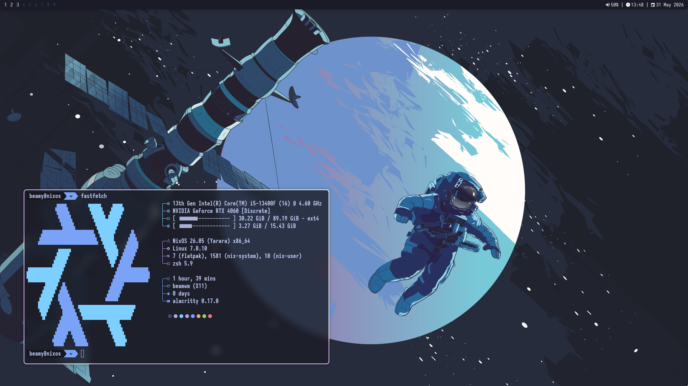

# beamwm
A lightweight, minimalist tiling window manager for X11 written in C. Everything is customized from `main.c` (which is barely above 1000 lines of code!)



## !! THIS WAS MADE BY ME BECAUSE OF BOREDOM, EXPECT ISSUES AND BUGS !!
## Features

- **Dynamic Tiling:** Automatic Master-Stack layout with adjustable master factor.
- **Floating Mode:** Toggle windows between tiled and floating modes.
- **Fullscreen:** Focused window can be toggled to occupy the entire screen.
- **Integrated Bar:** Displays workspaces, battery percentage, system volume, and date/time.
- **Multi-Workspace:** 9 Workspaces.
- **Mouse Support:** Move and resize floating windows, reorder tiled windows with drag-and-drop or resize tiled windows.
- **Gap & Border Support:** Customizable inner/outer gaps.

## Keybindings

| Keybinding | Action |
| :--- | :--- |
| `Ctrl` + `Alt` + `T` | Open Terminal (`st`) |
| `Super` + `R` | Run Launcher (`rofi`) |
| `Super` + `E` | File Manager (`pcmanfm`) |
| `Alt` + `F4` | Close focused window |
| `Super` + `T` | Toggle floating mode |
| `Super` + `F` | Toggle fullscreen |
| `Alt` + `Tab` | Cycle window focus |
| `Super` + `Arrows` | Focus window in direction |
| `Super` + `Shift` + `Arrows` | Move window in layout order |
| `Super` + `1-9` | Switch workspace |
| `Super` + `Shift` + `1-9` | Move window to workspace |
| `Super` + `LMB` (Drag) | Reorder tiled / Move floating |
| `Super` + `RMB` (Drag) | Adjust Master factor / Resize floating |
| `Super` + `Shift` + `E` | Kill the X Session |

## Installation

### Dependencies

```bash
libx11 libxft libxinerama libxrandr xorgproto
```
(aka dwm's deps)

### Building

1. Clone the repository.
2. Compile it via `make`:

```bash
sudo make clean install
```
## NixOS installation

1. Clone this repository
2. Add the following in `/etc/nixos/configuration.nix`:
```bash
environment.systemPackages = with pkgs; [
  (pkgs.callPackage /home/USER/beamwm/beamwm.nix {})
];
```
and
```bash
services.displayManager.sessionPackages = [ (pkgs.callPackage /home/USER/beamwm/beamwm.nix {}) ];
```
  **! Replace `USER` with your username and change the path to yours !**

3. Build by running:
```bash
sudo nixos-rebuild switch
```

After this, you can run beamwm via any Display Manager or via xinit.
Here's an example .xinitrc file:
```bash
exec beamwm
```
